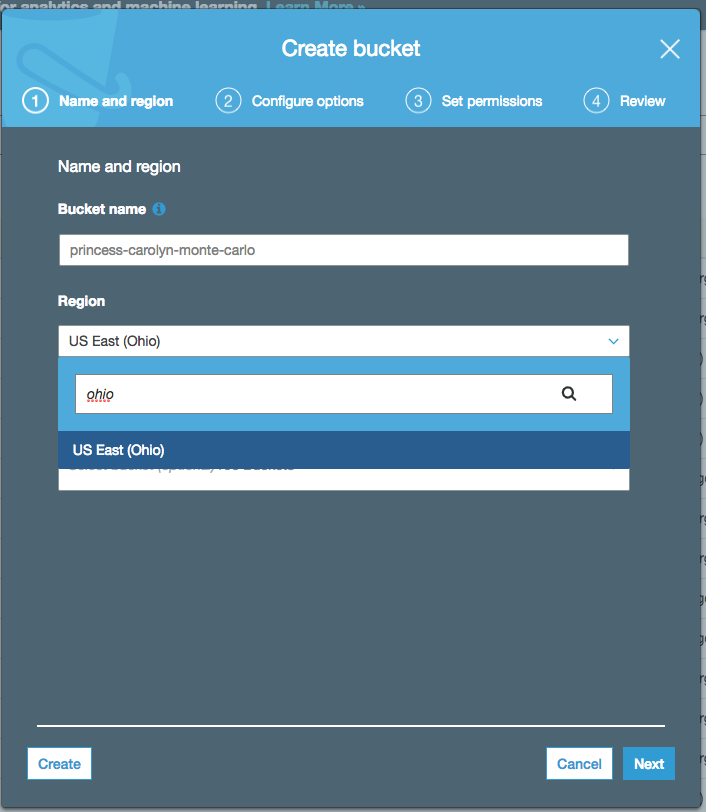

# Module 1: Create a S3 bucket to store the simulation results

Amazon S3 is object storage built to store and retrieve any amount of data from anywhere on the Internet. We will use it in the workshop as our persistent storage for putting the result files from our simulations. 

Once the files are stored in S3, you have many choices of analytics tools that can help analyze and visualize the data, such as [Amazon Athena](https://aws.amazon.com/athena/) (SQL queries on S3 data), [Amazon QuickSight](https://aws.amazon.com/quicksight/) (Dashboards and visualizations), [AWS Glue](https://aws.amazon.com/glue/) (ETL) etc.

## Instructions

1. Go to the S3 management console [link](https://console.aws.amazon.com/s3/home?region=us-east-2)  

	> Note: remember to press `ctrl` on Windows or `command` on Mac while you click on any links, so they open in a new tab

1. Click **Create bucket**

1. Use an unique name for your bucket name, e.g. `<your-username>-monte-carlo` 

1. Make sure the region is selected as Ohio 

	

1. Click **Create** on the lower left corner

1. Copy and save the name of the bucket you created in a text editor, you will need it later 

## Next step

Move on to [**Module 2: Create Cloud9 IDE environment**](./Module2.md)
