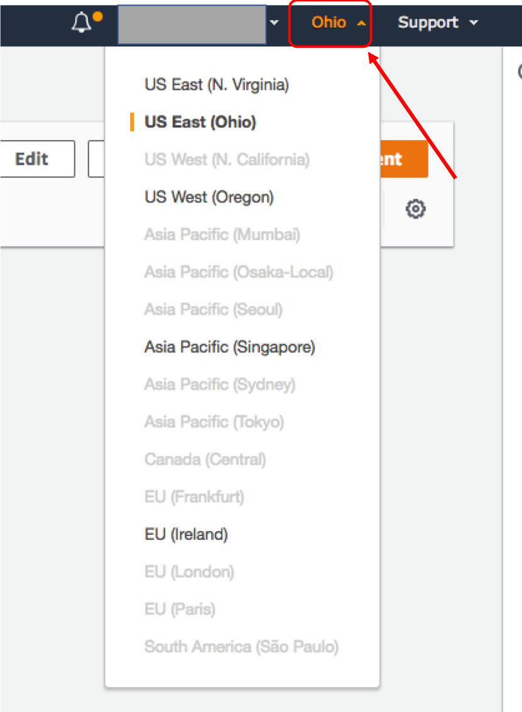
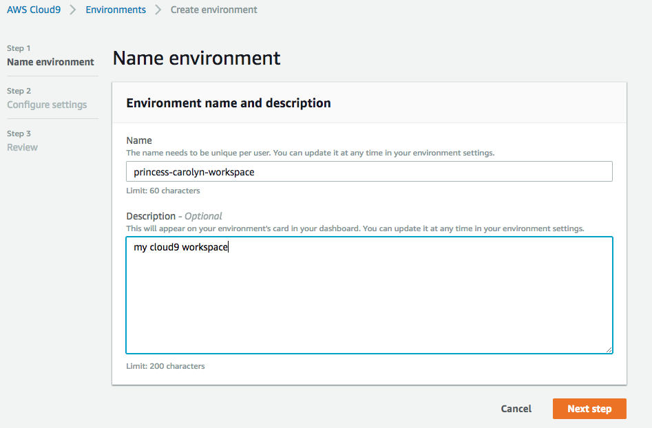
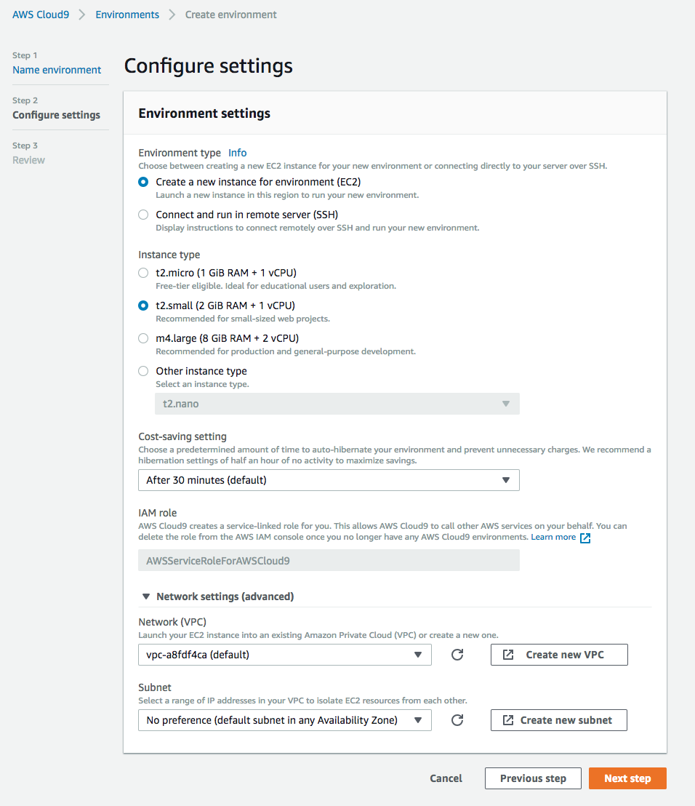

# Module 2: Create Cloud9 IDE environment

AWS Cloud9 is a cloud IDE accessed from your web browser. It comes prepackaged with essential tools for [many popular programming languages](https://docs.aws.amazon.com/cloud9/latest/user-guide/language-support.html). But what sets it part from other editors is its powerful pair programming features for ease of collaboration. Read more about cloud9 in this [blog](https://aws.amazon.com/blogs/aws/aws-cloud9-cloud-developer-environments/)

## Instructions

1. Go to the Cloud9 management console [link](https://us-east-2.console.aws.amazon.com/cloud9/home?region=us-east-2)  

1. Make sure you are in the **US East (Ohio)** region

	

1. Click **Create environment** 

1. For **Name**, use `<your-username>-workspace`. For example, `princess-carolyn-workspace`, click **Next step** 

	

1. For **instance type**, pick **t2.small**. Leave the rest as default, then click **Next step** 

	

1. Review the settings and click **Create environment**

1. You should now be redirected to the new IDE environment!  

## Next step

Move on to [**Module 3: Running the code in the Cloud9 IDE**](./Module3.md)
