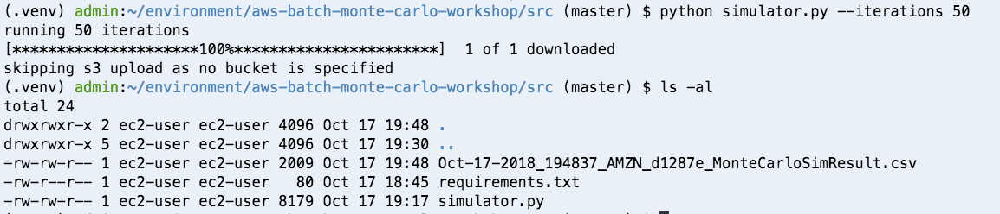
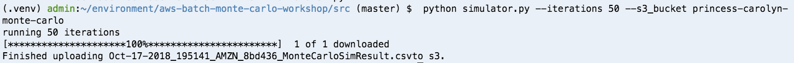
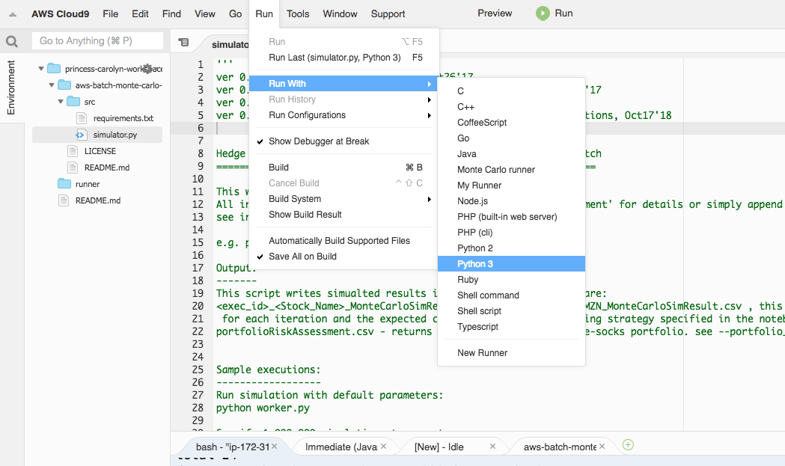
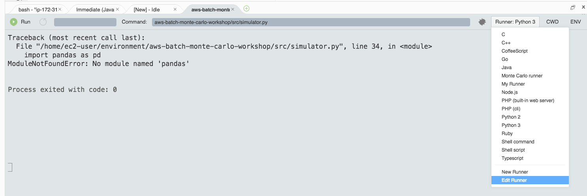
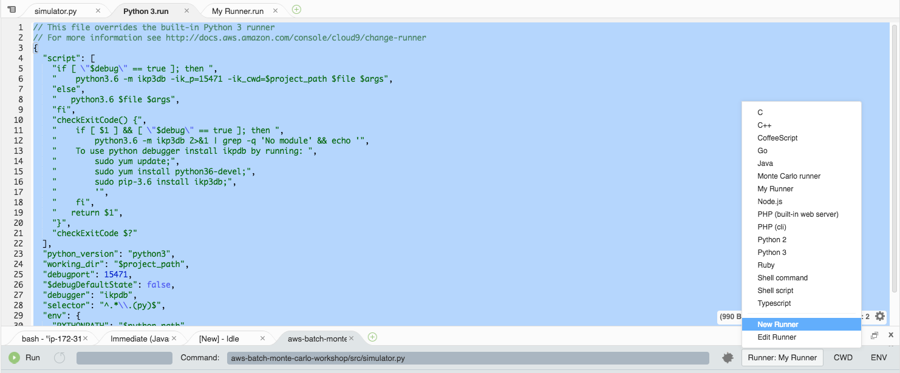
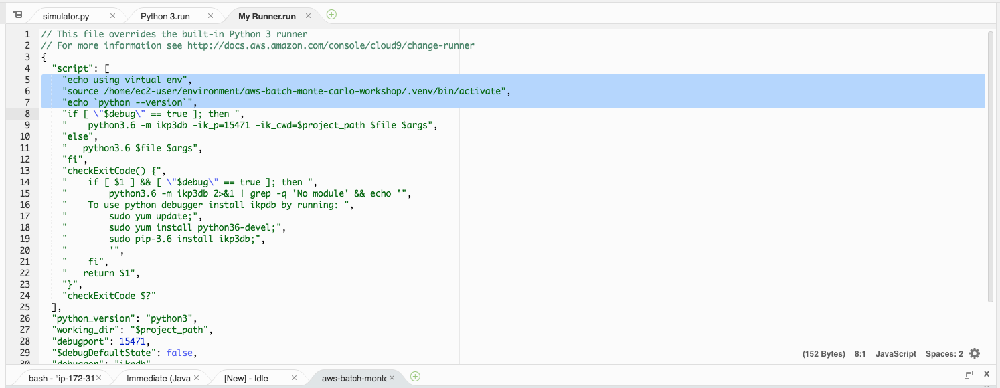
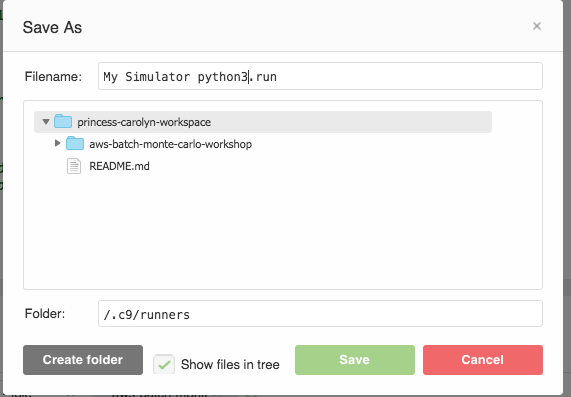
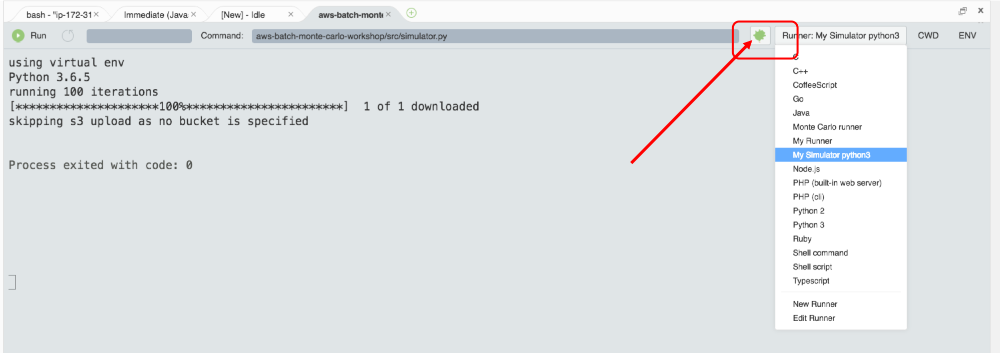

# Module 3 : Running the code in the Cloud9 IDE

In this module, you will use the Cloud9 IDE to download the simulation code and running the application locally in the IDE. 

As an optional step, you can test out Cloud9's debugging features

## Instructions

1. In the terminal window of the cloud9 environment, run the below to clone the github repo:

	```bash
	 git clone https://github.com/angelarw/aws-batch-monte-carlo-workshop
	```
	
1. Enter the downloaded directory with 

	```bash
	cd aws-batch-monte-carlo-workshop
	```
	
1. By default, Cloud9 uses python 2.7. Run the following the terminal to create a virtual environment for python 3.6. (There are also many other benefits of using [virtualenv](https://virtualenv.pypa.io/en/stable/) in managing python dependencies. )

	```bash
	unalias python
	virtualenv -p /usr/bin/python36 .venv
	source .venv/bin/activate
	```
	
1. Now if you check the python version by typing `python --version`, you should see something like this in the result:
	
	```
	(.venv) admin:~/environment/aws-batch-monte-carlo-workshop (master) $ python --version                          
	Python 3.6.5
	```
	
1. Now take a look at the main source code file, `src/simulator.py`
		
1. As you can see in the beginning of the file, multiple external libraries such as `pandas_datareader` and `numpy` are used in the code. We need to install the dependencies so we can run the code locally

	The required libraries are listed in `requirements.txt`, also in the `src` folder
	
	Back to the terminal window at bottom of screen, install the required dependencies by typing:
	
	```
	cd src/
	pip install -r requirements.txt 
	```

1. You are now ready to run the code locally! 

	As you can see in the `simulator.py` code, you can run this program by passing in different parameters. 
	
	In the terminal, try the following: 
	
	Show help message with `-h`
	
	```
	python simulator.py -h
	```

	Specify number of iterations to simulate: 
	
	```
	python simulator.py --iterations 50
	```
	
	You should see a csv generated as the result of the simulation run. We didn't specify a S3 bucket to upload the results to, so it's stored in the local file directory: 
	
	
	
	
	If you see an error, don't worry. Sometimes downloading the ticker data from Yahoo finance fail, so just rerun the script a few times.
	
1. You can open the resulting csv to see what it looks like. 
	
1.	Now, run the simulator in by specifying number of iterations and the bucket name you created in Module 1:
	
	```
	python simulator.py --iterations 50 --s3_bucket <replace_with_your_bucket_name>
	```

	When it succeeds, you should see the output like this:
	
	
	You can then go to the [S3 console](https://console.aws.amazon.com/s3/home) and verify the results have been uploaded to S3
	
## Module 3+ (Optional): Using the debugger 

Just like any other IDE, you can use cloud9 with a debugger. If you are interested in trying out the debugger, expand below for instructions. 

You are also welcome to skip ahead if the other modules are more of your interest. 
	

<details>
<summary><strong>Expand for optional module instructions</strong></summary><p>


1. In the cloud9 terminal, install the ikp3db debugger library 

	```
	pip install ikp3db;
	```

	> Cloud9 comes preinstalled with python debugger. However, since we are using virtualenv to manage our python dependencies, it creates a separate python runtime environment that we need to install the debugger for. 
	
1. Use the **Python 3 runner** to run `simulator.py`
	
	ensure  `simulator.py` is currently open, then go to **Run** --> **Run With** --> select **Python 3 **

	
	
1. Because our dependency libraries are installed with virtual env, the default runner is going to throw an error. Click on the **Runner** button to choose **Edit Runner**

	

1. You should see `Python 3.run` config file open up. Instead of overriding the default runner config, let's create a new configuration. 

1. First, copy the full content of the `Python 3.run` config file, then click on the Runner button again, and select "New Runner" this time 

	
	
1. Paste in the content copied from  `Python 3.run` file and add in these lines to the script section:

	```
    "echo using virtual env",
    "source /home/ec2-user/environment/aws-batch-monte-carlo-workshop/.venv/bin/activate",
    "echo `python --version`",

	```

	
	
	Save it and give it a name
	
	
	
1. You can now set up some breakpoints in the code, ensure the "**debug**" button is on (the green bug button) and choose the custom runner you just created, and start debugging the application! 

	
	
</details>


## Next step

Move on to [**Module 4: Build a docker container**](./Module4.md)
