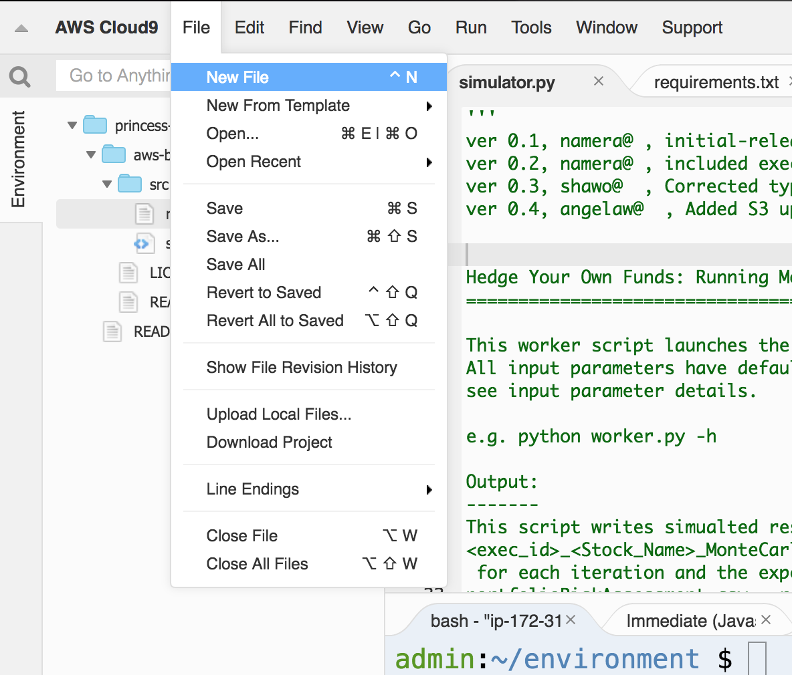
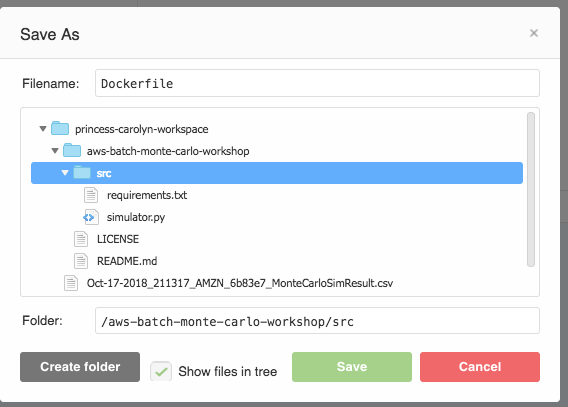
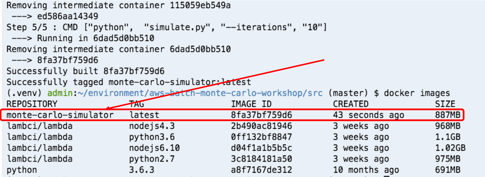
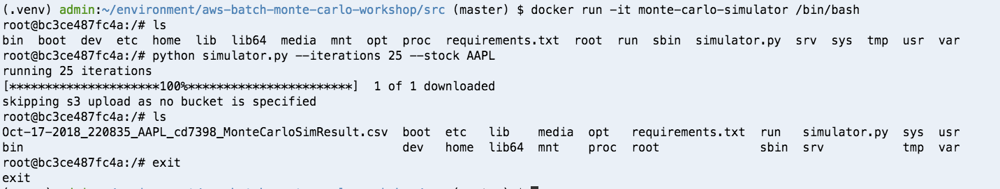

# Module 4: Build a docker container

Now we have tested the application, it's time to build a docker container! 

To build a docker container, we need to create a **Dockerfile**, a text document that contains all the commands to assemble an image. See more reference on Dockerfile [here](https://docs.docker.com/engine/reference/builder/#environment-replacement)

## Instructions 

1. Create a file in the Cloud9 IDE by going to **File** --> **New File**

	

1. Paste in below as the content for the Dockerfile:

	```
	FROM python:3.6.3
	COPY simulator.py simulator.py
	COPY requirements.txt requirements.txt
	RUN pip install -r requirements.txt
	CMD ["python",  "simulator.py", "--iterations", "10"]
	```
	
	Take a moment to review at how a simple Docker file is written: 
	
	**FROM \<image>:\<tag>**  Sets the base image. Must be first instruction in Dockerfile.

	**COPY \<src> \<dest>** Copies new files or directories from <src> and adds them to the filesystem of the container at the path <dest>. 

	**RUN \<command>** Executes any commands in a new layer on top of the current image and commit the results.

	**CMD [“exec”, “param1”, “param2”]** Sets the command to be executed when running the image.

	
1. Save the file as **Dockerfile** in the `src/` folder - **Make sure to captalize the D!**

	

1. In the terminal:

	Ensure you are in the `src/` directory:

	```
	cd ~/environment/aws-batch-monte-carlo-workshop/src
	```

	Build the docker image with tag `monte-carlo-simulator`
	
	```
	docker build -t monte-carlo-simulator .    
	```
	
1. You should now see your newly built docker image by running:

	```
	docker images
	```

	

1. You can run the docker image locally by 

	```
	docker run -t monte-carlo-simulator
	```
	
	When you don't specify additional commands, the container will run the `CMD` argument specified in our **Dockerfile** by default. When it's done executing all the commands, the container will exit. 
	
1. You can override the command the container runs by doing `docker run -t monte-carlo-simulator <command to run instead of default>`

	For example, the below will run the `ls` command in the container
	
	```
	docker run -t monte-carlo-simulator ls
	```
	
	The below will run the `python simulator.py --iterations 20 --stock AAPL` command in the container

	```
	docker run -t monte-carlo-simulator python simulator.py --iterations 20 --stock AAPL
	```
	
	Or the below will run the container and give you interactive shell access to it:

	```
	docker run -it monte-carlo-simulator /bin/bash
	```
	
	For example: 
	
	

	To exit out of the interactive bash, type: 
	
	```
	exit
	```
	
1. You may notice if try running the docker container with a s3 bucket, the run will fail: 

	```
	 docker run  -i monte-carlo-simulator  python simulator.py --iterations 40 --s3_bucket <your-bucket-name>
	```
	
	this is because the S3 SDK is trying to look for credentials to sign the request with. Typically in a dev environment, your credentials are stored in `~/.aws` folder, but your container doesn't have access to it. 
	
	Add the `-v ~/.aws:/root/.aws` flag to the command like below to mount the `~/.aws` folder from the host machine into the `/root/.aws` folder in the container:
	
	```
	 docker run  -v ~/.aws:/root/.aws  -it monte-carlo-simulator  python simulator.py --iterations 50 --s3_bucket <your-bucket-name>
	```
	
	Luckily, when you run the container using AWS Batch, the credential problem is automatically handled by assigning an IAM role to the container. See more info on that [here](https://docs.aws.amazon.com/AmazonECS/latest/developerguide/task-iam-roles.html)
	

## Next step

Move on to [**Module 5: Push the docker container to Amazon ECR**](./Module5.md)
