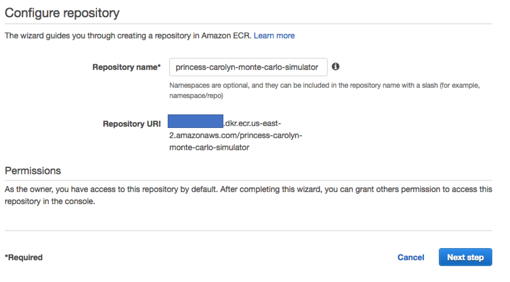
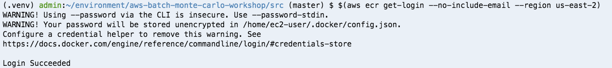
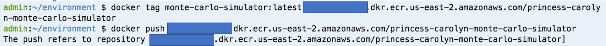
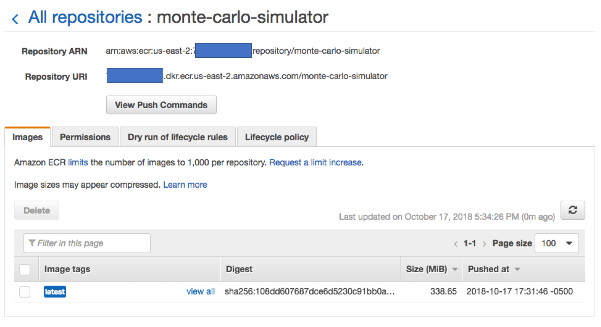

# Module 5: Push the docker container to Amazon ECR 

Amazon Elastic Container Registry (ECR) is a fully-managed Docker container registry that makes it easy for developers to store, manage, and deploy Docker container images. 

## Instructions
1. Go to the [ECR Console](https://us-east-2.console.aws.amazon.com/ecs/home?region=us-east-2#/repositories) (You can reach there also by looking for "ECS" or "container service" in the list of services from the console home page and go to ECR **Repositories** 
	
1. Click on **Create repository**

1. Give a name, such as `<your-username>-monte-carlo-simulator` to your repo, then click **Next Step**

	
	
1. In the following screen, you will be presented many useful commands. Start with the login command, copy and paste into the Cloud9 terminal:

	

1. Now you are logged in, use the provided commands to 
	
	* tag your image to prepare it to be pushed (note: change the default command to match the image tag you built in previous steps) 
	
	* push the image to ECR 

	
	
1. Now if you check your ECR repository, you should see the pushed docker image

	

## Next step

Move on to [**Module 6: Create an IAM role for the container**](./Module6.md)
