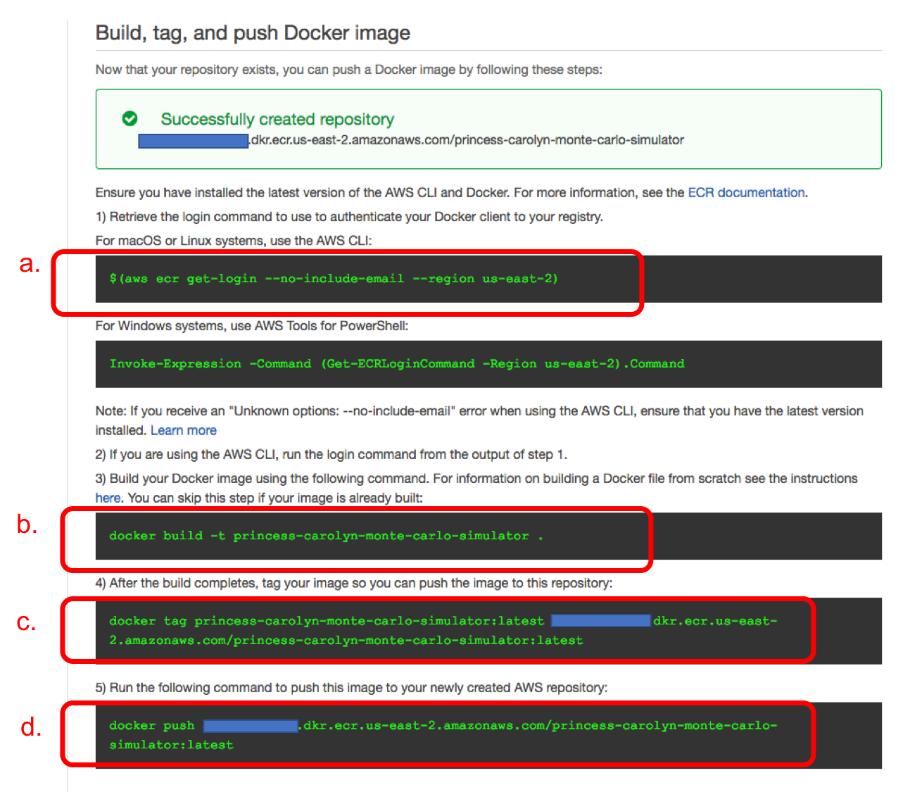

# Module 5: Push the docker container to Amazon ECR 

Amazon Elastic Container Registry (ECR) is a fully-managed Docker container registry that makes it easy for developers to store, manage, and deploy Docker container images. 

## Instructions
1. Go to the [ECR Console](https://us-east-2.console.aws.amazon.com/ecs/home?region=us-east-2#/repositories) (You can reach there also by looking for "ECS" or "container service" in the list of services from the console home page and go to ECR **Repositories** 
	
1. Click on **Create repository**

1. Give a name, such as `<your-username>-monte-carlo-simulator` to your repo, then click **Next Step**

	
	
1. In the following screen, you will be presented many useful commands. Follow the commands (a-d) to login to the registry, build the container, tag the container and push to the repo. 

		

	
1. After the push succeeds, now if you check your ECR repository, you should see the pushed docker image

	
	
1. If you need to refer back to the push commands, you can find the **View Push Commands** button in the repository console page. 

## Next step

Move on to [**Module 6: Create an IAM role for the container**](./Module6.md)
