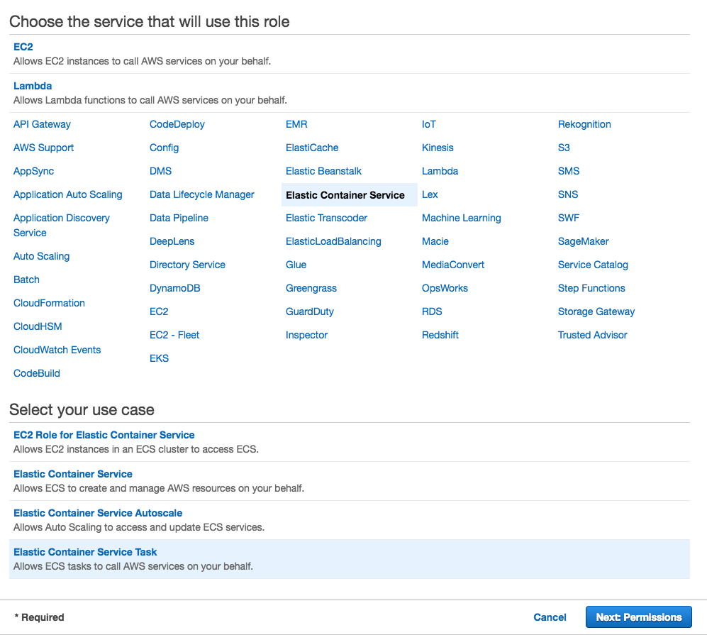
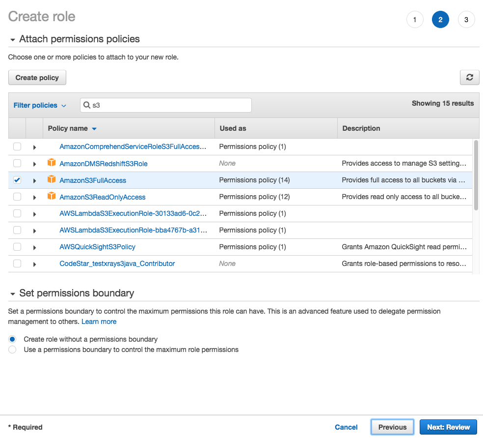

## Module 6: Create an IAM role for the container 

Remember the architecture?

When we use AWS batch to schedule and run multiple containers in parallel, each container needs to be able to access S3 to store the simulation results. To grant permission for the containers to access S3 securely, the best way to achieve this is creating an [**IAM role**](https://docs.aws.amazon.com/IAM/latest/UserGuide/id_roles.html) that the containers will use. With IAM roles, temporary security credentials are created dynamically that are only usable by the entities you specify. 

To create this IAM role: 

1. Go to the [IAM console ](https://console.aws.amazon.com/iam/home#/roles)
1. Go to **Roles**, then **Create role**
1. In the **Select type of trusted entity** screen, select **Elastic Container Service** under list of services, then select **Elastic Container Service Task**

	

1. In the **Attach permissions** policies screen, look for S3 in the search bar and pick **AmazonS3FullAccess**

	

1. For Role name, pick a unique name e.g. `<your-user-name>-monte-carlo`, and click **Create role**

## Next step

Move on to [**Module 7: Create AWS Batch job**](./Module7.md)
