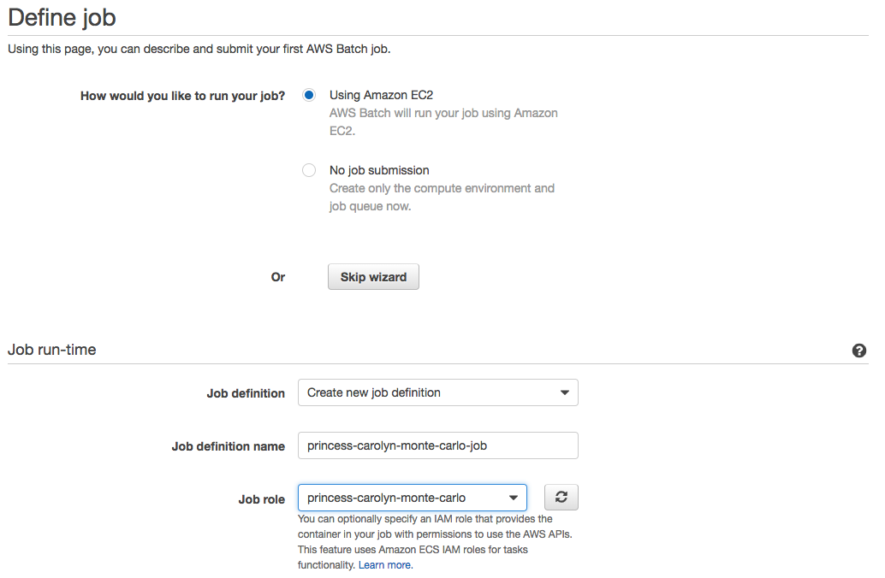
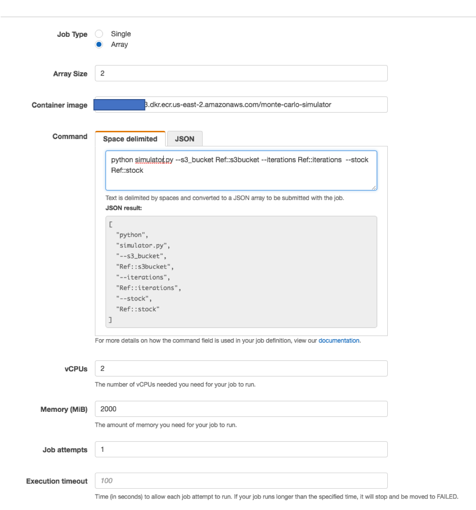
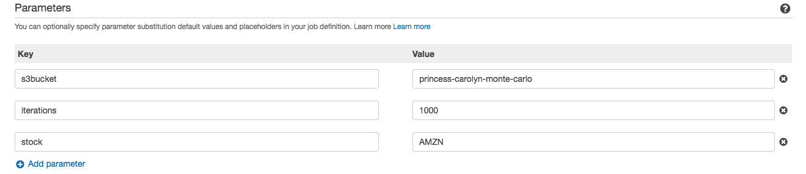
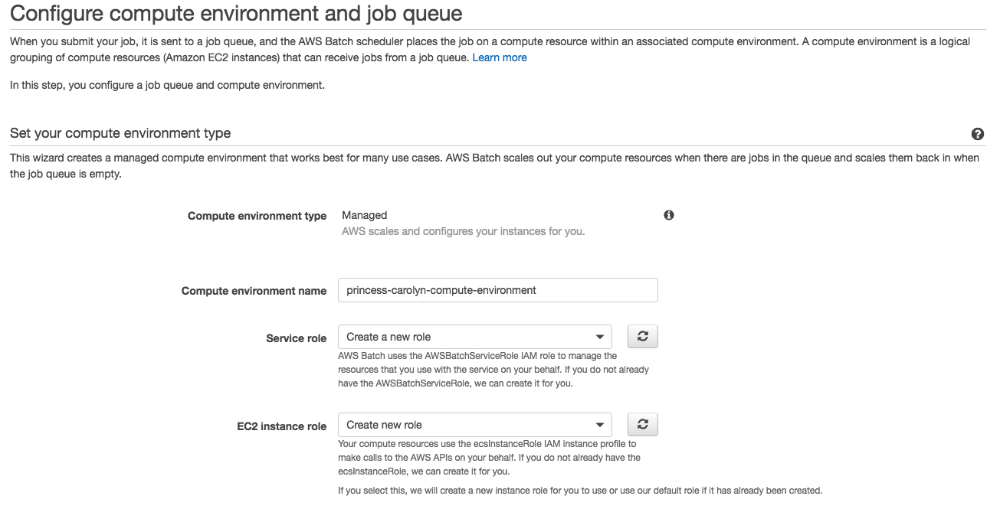
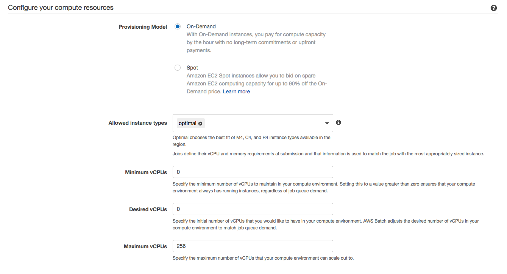
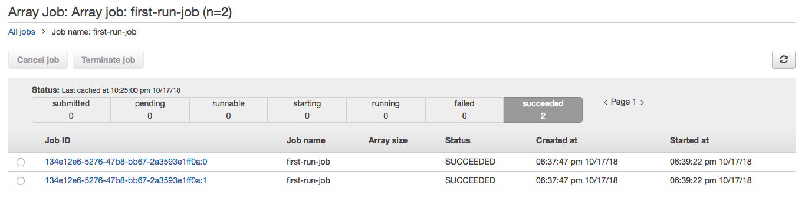
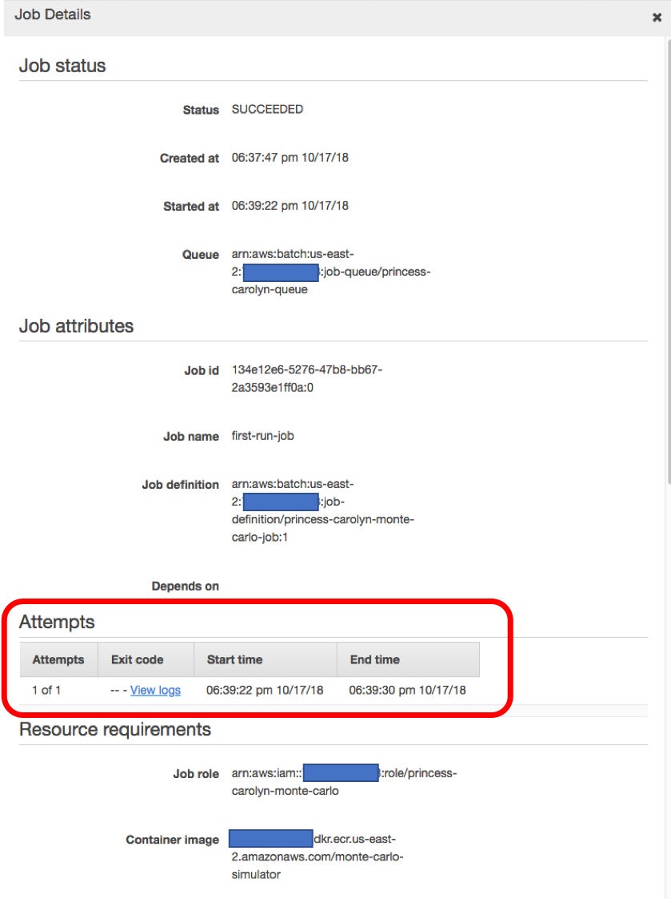

# Module 7: Create AWS Batch job 

In this section, we will use the AWS batch first run wizard to walk through:

* Create a job queue
* Create a managed compute environment (infrastructure that containers will run on)
* Create a job definition 
* Submit batch job

## Instructions

1. Click [here](https://us-east-2.console.aws.amazon.com/batch/home?region=us-east-2#/wizard) to go to the AWS Batch wizard 

1. Make sure **Using Amazon EC2** radio button is selected

1. Under **Job run-time**, create a new job definition:

	* **Job definition name**: `<your-user-name>-monte-carlo-job`
	* **Job role**: Pick the role you just created in module 6
 
 	

1. Under **Container properties** 

	* For **Job type**, select **Array** 

		> Array jobs let you run a collection of related, yet separate batch jobs that may be distributed across multiple hosts and may run concurrently. This is a perfect use case for our monte carlo simulation that can easily be parallelized to be run simultaneously across multiple containers
	
	* For **Array size**, select 2 as the value for an initial test 

	* For **container image** field, fill in the URI of container repo you have created in Module 5:
	
		It should be in the format of `<account-id>.dkr.ecr.us-east-2.amazonaws.com/<your-username>-monte-carlo-simulator`
	
		You can also look it up from the [ECR Console](https://us-east-2.console.aws.amazon.com/ecs/home?region=us-east-2#/repositories)
	
	* For the **Command** to run, put in the following: note that we are use the **Parameters** feature such as `Ref::s3bucket` so we can easily update it when submitting future jobs: 	
	```
	python simulator.py --s3_bucket Ref::s3bucket --iterations Ref::iterations --stock Ref::stock
	```
	
	

1. In the **Parameters** section, put in the default parameters for the job definition (you can override them when submitting future jobs)

	* **Key**: `s3bucket`   **Value**: `<your-name>-monte-carlo` (the name of bucket you created in module 1)
	* **Key**: `iterations`   **Value**: `1000` 
	* **Key**: `stock`   **Value**: `AMZN`   

	

1. Click **Next** 
1. In the **Set your compute environment type** section, use `<your-username>-compute-environment` and leave the rest as default

	
	
1. In **Configure your compute resources**, keep the defaults

	


1. in **Set up your job queue**, use `<your-username>-compute-environment` as the queue name:

	

1. Finally, click **Create**
 
1. You now have created 

	* A job queue
	* A managed compute environment (infrastructure that containers will run on)
	* A job definition 
	* And your first AWS Batch job is just submitted! 

	
1. Go to **Dashboard** to see your job getting run. 

1. First time the jobs are run will take a little more time (several few minutes) before the jobs go into a **RUNNING** state, because AWS Batch needs to spin up some EC2 instances to run your containers. Using a Managed compute environment with AWS Batch mean it will automatically scale up and down the EC2 instances that will be used to run your containers. 

1. Click on the running/succeeded job to view the details. Note that because we submitted an array job with size=2, you can see batch scheduled 2 and run 2 containers: 

	

	By clicking into the job IDs, you can see more details of the job run. You can find the execution logs, start and end time, etc. in the **Attempts** section. 
	
	


 Occasionally, your batch job might fail. For example, in the case of this simulation workshop, you may see the jobs fail intermittently due to the code temporarily unable to download the historical stock data from yahoo finance. (Usually, the execution logs can help you troubleshoot)

 Thankfully, AWS batch provides an easy mechanism to enable job retries! 
 
 Go to [**next module**](./Module8.md) to learn how to make your batch jobs more resilient to failures! 