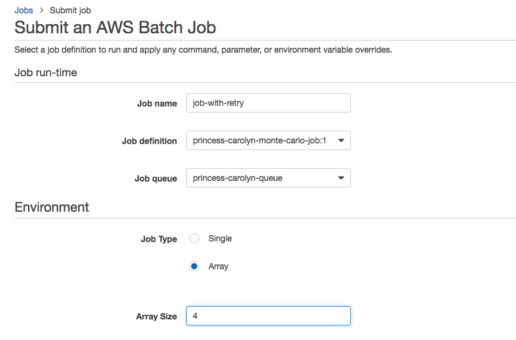
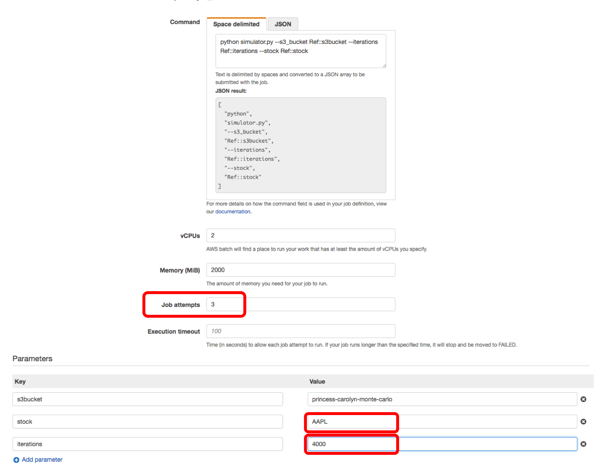

# Module 8: Submit AWS Batch job with automated retries

As you may have noticed in the last module, occasionally, your batch job might fail. In this module, we take advantage of the [**Automated job retry**](https://docs.aws.amazon.com/batch/latest/userguide/job_retries.html) feature of AWS Batch to make our batch job more resilient

## Instructions

1. Create a new job by clicking on **Submit job** in the [AWS Batch console](https://us-east-2.console.aws.amazon.com/batch/home?region=us-east-2#/jobs) under the Jobs tab  

1. For Job run-time:
	* **Job name**: use `job-with-retry` 
	* **Job definition**: pick the definition you created in last module (e.g. "<your-user-name>-monte-carlo-job")
	* **Job queue**: the job queue you created in last module (e.g. "<your-user-name>-queue")
 
1. For environment

	* Pick `Array` **job type** again
	* For Array size, use `4` this time to add more load
	
	

1. To use automated retries, all you need to do is specify number of retres in the **Job attempts** field. 

	* Use `3` for **Job attempts**
	* To change things up a bit, use a different stock ticker, e.g. `AAPL` for this simulation run
	* Up the number of iterations per run to `4000`
	
	

1. Click **Submit job** 

1. Watch the jobs transition between [job states](https://docs.aws.amazon.com/batch/latest/userguide/job_states.html) 

1. Look at the job details, you may notice your jobs get multiple retries if it encountered the download failure!

	

# Next step 

You have successfully built an batch job in a Docker container that can elastically scale to your needs and automatically retries upon failures! 

There are a lot more things you can do, and head to the [extra credit](ExtraCredit.md) section for some ideas! 

Or if you are done, go to [clean up](cleanup.md) section to clean up the environment. 