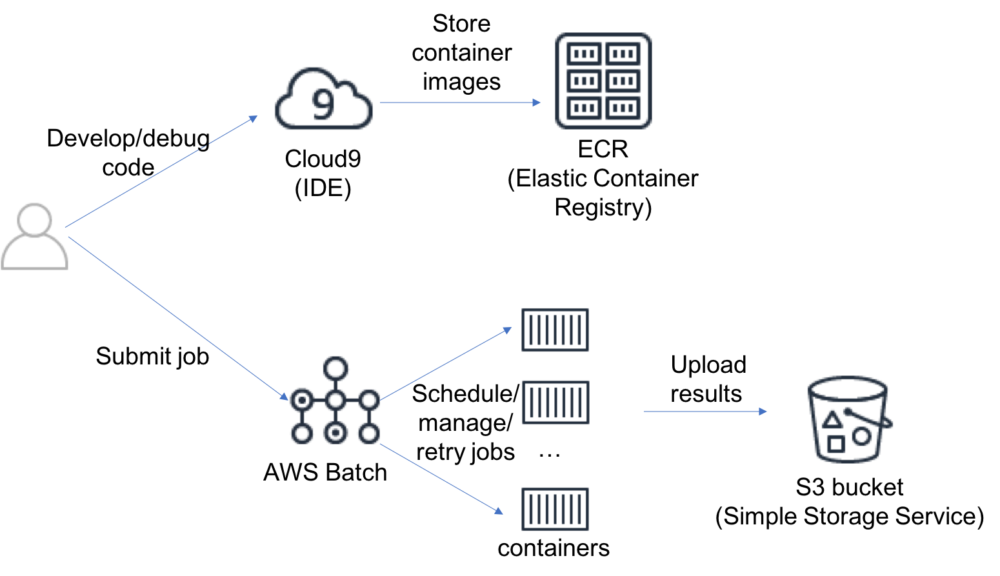

# Monte Carlo Simulation using AWS Batch
A forked version of [ec2-spot-montecarlo-workshop](https://github.com/aws-samples/ec2-spot-montecarlo-workshop) that focuses on Cloud9 and AWS Batch

## Links to workshop steps

* [Module 1: Create a S3 bucket to store the simulation results](./Module1.md)
* [Module 2: Create Cloud9 IDE environment](./Module2.md)
* [Module 3: Running the code in the Cloud9 IDE](./Module3.md)
* [Module 4: Build a docker container](./Module4.md)
* [Module 5: Push the docker container to Amazon ECR](./Module5.md)
* [Module 6: Create an IAM role for the container](./Module6.md)
* [Module 7: Create AWS Batch job](./Module7.md)
* [cleanup](./cleanup.md)
